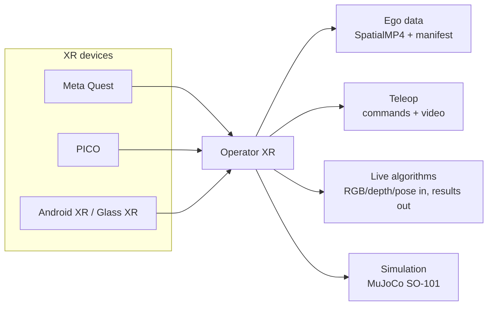
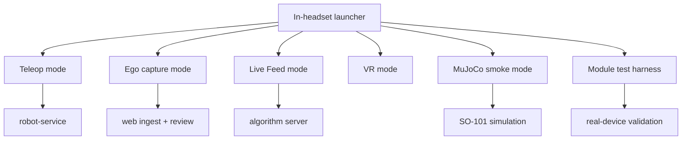
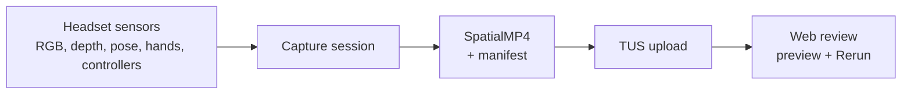
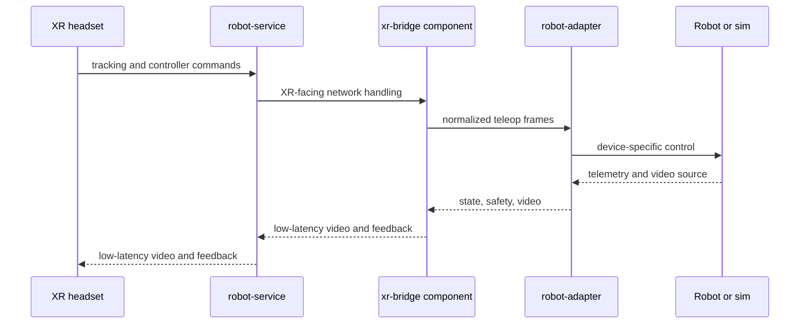
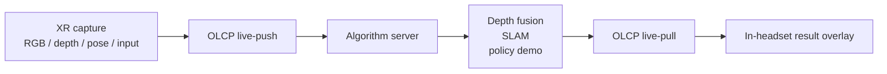
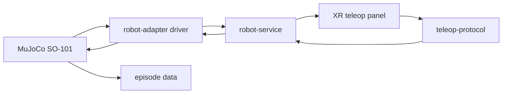

# Operator

**One XR operator console for robot teleoperation, egocentric data collection,
and real-time algorithm demo.**

Operator turns Android XR headsets into a robotics interface that can record
high-value ego data, drive robots, and stream live perception results back into
the headset. The same system is built around multiple XR families: PICO, Meta
Quest, and Android XR-class devices.

<p align="center">
  
</p>

<table>
  <tr>
    <td align="center" width="25%">
      <br>
      <strong>Quest 3</strong>
    </td>
    <td align="center" width="25%">
      <br>
      <strong>Quest 3S</strong>
    </td>
    <td align="center" width="25%">
      <br>
      <strong>PICO 4 Ultra</strong>
    </td>
    <td align="center" width="25%">
      <br>
      <strong>Android XR</strong>
    </td>
  </tr>
</table>

Warning: pico neo3 or older version, and quest2 or older version is not supported.

## Why Operator

| Points | What it unlocks |
| --- | --- |
| Multi-device XR | One Godot/OpenXR client architecture for PICO, Quest, and Android XR-class targets, with vendor adapters where the hardware exposes richer camera, body, depth, QR, and tracking APIs. |
| Powerful workflows | A single in-headset launcher covers ego recording, robot teleop, live algorithm demos, VR mode, MuJoCo device smoke tests, and module tests. |
| Robot-ready data loop | Headset sensors become commands, recordings, live streams, review artifacts, and algorithm overlays without splitting into separate apps. |
| Local-first development | Rust robot bridge, Next.js ingest/review UI, MuJoCo examples, and device tests live in one repository. |



## Platform Coverage

| XR family | Runtime path | Main use |
| --- | --- | --- |
| Meta Quest | `make build-quest`, Meta/OpenXR vendor integrations | Teleop, ego capture, live feed, depth/body-capable device tests. |
| PICO | `make build-pico`, PICO OpenXR loader and capture path | Teleop, ego capture, live feed, PICO body/motion/camera paths. |
| Android XR / Glass XR | `Glass XR` export preset plus generic OpenXR adapter | Android XR-class packaging and baseline headset runtime. |



## What It Does

### 1. Record Ego Data

Capture sessions write SpatialMP4 artifacts with timed metadata plus a
`manifest.json` for file inventory and hashes. Debug sidecars can still be
exported, but the raw MP4 is the canonical replay artifact.



### 2. Teleoperate Robots

The headset sends tracking and controller state through the teleop protocol.
Robot video and telemetry come back to the in-headset panel so operation stays
inside the XR view.



### 3. Run Real-Time Algorithm Demos

Live Feed is the online path: the headset streams RGB/depth/pose samples to a
server, the server runs perception or policy code, and the headset renders the
result stream as an overlay.



### 4. Prototype Before Hardware

The examples include a MuJoCo SO-101 arm path and a live-feed depth-fusion
server prototype, so new robot mappings and perception loops can be exercised
before moving to a physical robot.



## Quick Start

XR builds run from `xr/` and require [Godot 4.5.1 stable](https://godotengine.org/download/archive/4.5.1-stable/), matching Android export
templates, Android platform tools, and a real Android XR device for runtime tests.

```bash
cd xr
make deps

# for quest
make build-quest
make install-quest
make ship-quest

# for pico
make build-pico
make install-pico
make ship-pico
```

> [!IMPORTANT]
> Ego **depth** capture needs the patched OpenXR Vendors plugin. A plain
> `make build-quest` fetches the unpatched vendor binaries and silently records
> no depth. See [Build & Install the XR App](claw/develop/build-app.md) for the
> `prepare.sh --build-patched` step.

Robot-side Rust commands run from `robot/`:

```bash
cd robot
cargo build --release
cargo test

# Real SO-101 robot service examples:
cargo run -p robot-service -- --config configs/so101_real.yaml
cargo run -p robot-service -- --config configs/so101_dual_real.yaml
```

Web ingest and review app commands run from `web/`:

```bash
cd web
npm install
npm run dev
```

MuJoCo example:

```bash
cd examples/mujuco-arm-so101
make env
make run-sim
```

## Documentation

Deeper docs live under `claw/`:

- [Build & install the XR app](claw/develop/build-app.md) — APK build, install, and the patched-vendor step required for ego depth capture.
- [Architecture overview](claw/architecture/overview.md) — current system architecture.
- Development guides (`claw/develop/`):
  - [Add a new teleop video source](claw/develop/add-new-video-source.md)
  - [Add a new VR device or brand](claw/develop/add-new-vr-device-or-brand.md)
  - [Make a new robot](claw/develop/make-new-robot.md)

## Join group

We are active in xhs and wechat, please join us:

<table>
  <tr>
    <td align="center" width="25%">
      <br>
      <strong>xhs</strong>
    </td>
    <td align="center" width="25%">
      <br>
      <strong>wechat</strong>
    </td>
  </tr>
</table>

If qr code is out of date, please [create an issue](https://github.com/lovemoon-ai/operator/issues/new) for a new one.
