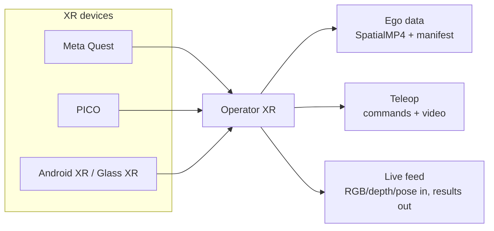

# Operator

**One XR operator console for robot teleoperation, egocentric data collection,
and real-time algorithm demo.**

Operator turns Android XR headsets into a robotics interface that can record
high-value ego data, drive robots, and stream live perception results back into
the headset. The same system is built around multiple XR families: PICO, Meta
Quest, and Android XR-class devices.

<p align="center">
  
</p>

<table>
  <tr>
    <td align="center" width="25%">
      <br>
      <strong>Quest 3</strong>
    </td>
    <td align="center" width="25%">
      <br>
      <strong>Quest 3S</strong>
    </td>
    <td align="center" width="25%">
      <br>
      <strong>PICO 4 Ultra</strong>
    </td>
    <td align="center" width="25%">
      <br>
      <strong>Android XR</strong>
    </td>
  </tr>
</table>

Warning: pico neo3 or older version, and quest2 or older version is not supported.

## Why Operator

| Points | What it unlocks |
| --- | --- |
| Multi-device XR | One Godot/OpenXR client architecture for PICO, Quest, and Android XR-class targets, with vendor adapters where the hardware exposes richer camera, body, depth, QR, and tracking APIs. |
| Powerful workflows | A single in-headset launcher covers ego recording, robot teleop, live algorithm demos, VR mode, MuJoCo device smoke tests, and module tests. |
| Robot-ready data loop | Headset sensors become commands, recordings, live streams, review artifacts, and algorithm overlays without splitting into separate apps. |
| Local-first development | Rust robot bridge, Next.js ingest/review UI, MuJoCo examples, and device tests live in one repository. |



## Quick Start

XR builds run from `xr/` and require [Godot 4.5.1 stable](https://godotengine.org/download/archive/4.5.1-stable/), matching Android export
templates, Android platform tools, and a real Android XR device for runtime tests.

```bash
cd xr
make deps

# for quest
make build-quest
make install-quest
make ship-quest

# for pico
make build-pico
make install-pico
make ship-pico
```

> [!IMPORTANT]
> Ego **depth** capture needs the patched OpenXR Vendors plugin. A plain
> `make build-quest` fetches the unpatched vendor binaries and silently records
> no depth. See [Build & Install the XR App](claw/develop/build-app.md) for the
> `prepare.sh --build-patched` step.

Robot-side Rust commands run from `robot/`:

```bash
cd robot
cargo build --release
cargo test

# Real SO-101 robot service examples:
cargo run -p robot-service -- --config configs/so101_real.yaml
cargo run -p robot-service -- --config configs/so101_dual_real.yaml
```

Python-first embedded XR (the Python process owns bridge, retargeting, IK, and
the robot integration):

```bash
# Editable installs require a modern pip with PEP 660 support.
python -m pip install -e ./python
```

```python
from pyoperator import xr_bridge

xr_bridge.start()
frame = xr_bridge.wait_next(timeout=5.0)  # one atomic immutable snapshot
print(frame.timestamp_ns, frame.controllers.right.pose if frame else None)
xr_bridge.stop()
```

See [`python/README.md`](python/README.md) for custom `Robot`,
retargeting/IK, record/replay, and the existing standalone-bridge hosted mode.

Web ingest and review app commands run from `web/`:

```bash
cd web
npm install
npm run dev
```

MuJoCo example:

```bash
cd examples/mujuco-arm-so101
make env
make run-sim
```

## Join group

We are active in xhs and wechat, please join us.

You can get xhs group or wechat group QR code from this guy: 

<table>
  <tr>
    <td align="center" width="25%">
      <br>
      <strong>wechat</strong>
    </td>
  </tr>
</table>

> Sorry, because the group QR code expires easily, only the admin's WeChat has been provided. 
> You can add him first and ask him to invite you into the group.
