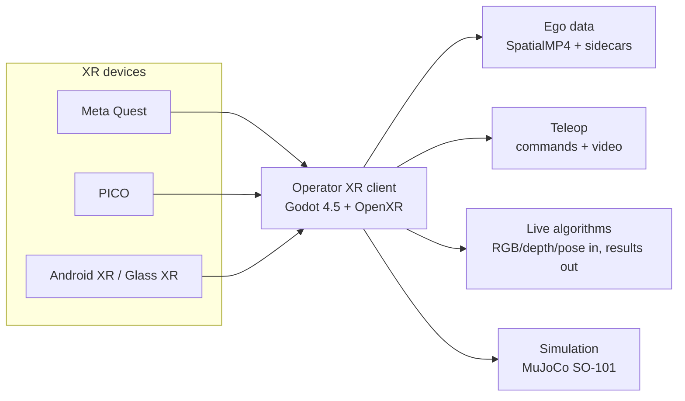
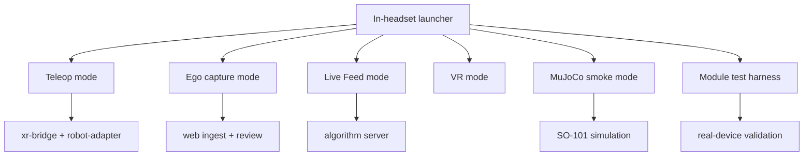
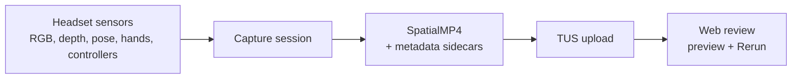
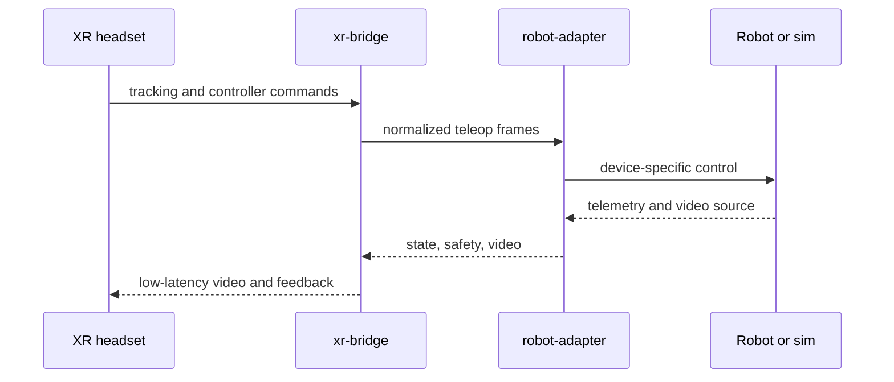
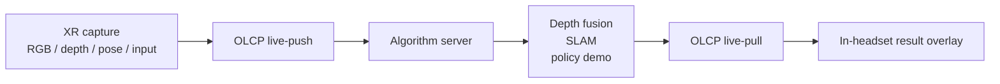
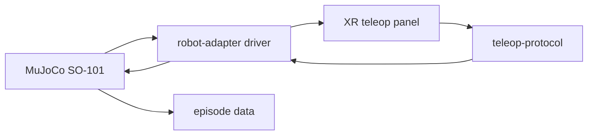

# Operator

**One XR operator console for robot teleoperation, egocentric data collection,
and real-time algorithm demo.**

Operator turns Android XR headsets into a robotics interface that can record
high-value ego data, drive robots, and stream live perception results back into
the headset. The same system is built around multiple XR families: PICO, Meta
Quest, and Android XR-class devices.

<p align="center">
  
</p>

<table>
  <tr>
    <td align="center" width="25%">
      <br>
      <strong>Quest 3</strong>
    </td>
    <td align="center" width="25%">
      <br>
      <strong>Quest 3S</strong>
    </td>
    <td align="center" width="25%">
      <br>
      <strong>PICO 4 Ultra</strong>
    </td>
    <td align="center" width="25%">
      <br>
      <strong>Android XR</strong>
    </td>
  </tr>
</table>

## Why Operator

| Core sell point | What it unlocks |
| --- | --- |
| Multi-device XR | One Godot/OpenXR client architecture for PICO, Quest, and Android XR-class targets, with vendor adapters where the hardware exposes richer camera, body, depth, QR, and tracking APIs. |
| Powerful workflows | A single in-headset launcher covers ego recording, robot teleop, live algorithm demos, VR mode, MuJoCo device smoke tests, and module tests. |
| Robot-ready data loop | Headset sensors become commands, recordings, live streams, review artifacts, and algorithm overlays without splitting into separate apps. |
| Local-first development | Rust robot bridge, Next.js ingest/review UI, MuJoCo examples, and device tests live in one repository. |



## Platform Coverage

| XR family | Runtime path | Main use |
| --- | --- | --- |
| Meta Quest | `make build-quest`, Meta/OpenXR vendor integrations | Teleop, ego capture, live feed, depth/body-capable device tests. |
| PICO | `make build-pico`, PICO OpenXR loader and capture path | Teleop, ego capture, live feed, PICO body/motion/camera paths. |
| Android XR / Glass XR | `Glass XR` export preset plus generic OpenXR adapter | Android XR-class packaging and baseline headset runtime. |



## What It Does

### 1. Record Ego Data

Capture sessions can write SpatialMP4 artifacts, timed metadata, JSONL sidecars,
and upload them into the local review app. That gives you inspectable headset
episodes instead of loose videos.



### 2. Teleoperate Robots

The headset sends tracking and controller state through the teleop protocol.
Robot video and telemetry come back to the in-headset panel so operation stays
inside the XR view.



### 3. Run Real-Time Algorithm Demos

Live Feed is the online path: the headset streams RGB/depth/pose samples to a
server, the server runs perception or policy code, and the headset renders the
result stream as an overlay.



### 4. Prototype Before Hardware

The examples include a MuJoCo SO-101 arm path and a live-feed depth-fusion
server prototype, so new robot mappings and perception loops can be exercised
before moving to a physical robot.



## Repository Map

| Path | Owns |
| --- | --- |
| `xr/` | Godot 4.5 Android XR client, launcher modes, vendor integrations, capture, teleop UI, live feed, device test harness. |
| `robot/` | Rust `teleop-protocol`, `xr-bridge`, `robot-adapter`, safety, discovery, video relay, and robot drivers. |
| `web/` | Local ingest, session review, upload tokens, preview generation, and Rerun visualization. |
| `examples/` | MuJoCo SO-101 simulation and live-feed algorithm server prototypes. |
| `tests/` | Static validation plus real-device smoke and E2E scripts. |
| `claw/architecture/` | Current architecture docs and protocol details. |

## Quick Start

XR builds run from `xr/` and require Godot 4.5.1 stable, matching Android export
templates, Android platform tools, and a real Android XR device for runtime
tests.

```bash
cd xr
make deps
make build-quest
make build-pico
make install-quest
make install-pico
make ship-quest
make ship-pico
```

Robot-side Rust commands run from `robot/`:

```bash
cd robot
cargo build --release
cargo test
```

Web ingest and review app commands run from `web/`:

```bash
cd web
npm install
npm run dev
```

MuJoCo example:

```bash
cd examples/mujuco-arm-so101
make env
make run-sim
```

## Validation

Static checks that do not launch the XR runtime:

```bash
python3 tests/validate_xr_features.py
python3 tests/validate_xr_test_manifests.py
bash tests/03_godot_mujoco_static.sh
```

Device tests run only with the target headset attached:

```bash
bash tests/01_rtsp_test.sh
bash tests/02_ego_record.sh
bash tests/03_godot_mujoco_device.sh --device quest
bash tests/03_godot_mujoco_device.sh --device pico
bash tests/04_live_feed_e2e.sh
bash tests/xr_module_harness.sh --suite capture.pipeline --serial <serial>
```

Do not use desktop `godot --headless` as a runtime substitute. The XR client
depends on Android XR device APIs; headless Godot is used for export tooling
only.

## Docs

- Architecture index: `claw/CLAW.md`
- System overview: `claw/architecture/overview.md`
- XR client: `claw/architecture/xr-client.md`
- Build and deploy: `claw/architecture/build-and-deploy.md`
- Wire protocols: `claw/architecture/wire-protocol.md`
- Live Feed: `claw/architecture/live-feed-cloud.md`
- Robot side: `claw/architecture/rust-agent.md`
